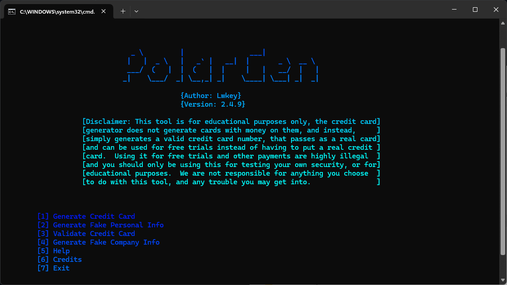

<p align=center>
  
</p>
  
```
An open source information generator!
```
<p align = "center">
  
  
  
  
  
  
  
  
  


</p>

<br>

<br>

# What is PolarGen?

- `PolarGen` is a __Information Generating Script__, which is a one-stop tool for generating fake info such as valid credit cards, names, addresses, emails, jobs, phone numbers, etc, as well as being able to validate a credit card.
- This tool mainly uses __Faker__ python library, in order to generate the credit cards, names, etc.
- The way the credit cards are generated is by utilizing an algorithim called the Luhn algorithim, which is what all credit cards follow.  

# :heavy_exclamation_mark: DISCLAIMER: 
**Using it for the purpose of free trials, or public payments to a place/organization that is not yours is illegal, and should not be done under any circumstances.  The main reason I put it into this tool was for educational purposes, and so that people could test the security of their own websites and buisnesses.  We are not responsible for anything you choose to do with this tool, and any trouble you may get into.**
<br>

#  SCREENSHOT
-Please note the screenshot may not be the latest version


<br>


## Quick Guide

> Install, Update, Usage

<br>

# :heavy_check_mark: INSTALLATION WINDOWS:
-First you need to download the zip file by clicking code and then clicking download ZIP  
-Next, extract the zip file    
-Once extracted, open the extracted folder in terminal by right clicking on an empty space while in the folder, and clicking the CMD button  
-Then run

```
pip install -r req.txt
```
__Once the requirements have been installed, simply close out of terminal and double click the `PolarGen.BAT` file__  

# :heavy_check_mark: Linux/Mac install:
-__First, make sure you have `pip` installed__  
-Then, go into terminal, and type
```
git clone https://github.com/LwkeyDev/PolarGen.git  
```
__Once installed, go into the directory (CD for linux) and type__
```
pip install -r req.txt
``` 
Now, to run the tool, simply type  

```
python3 PolarGen.py
```

<br>

### NOTES:

```
- `PolarGen` is back with all new features and user interface
- `v1.1.7` has tools with no _api key_ requirement
-Please read Disclaimer before use
```

</p>


Credits:
```
Author: Lwkey/LwkeyDev 
Libraries used from adelq, and joke2k
```
